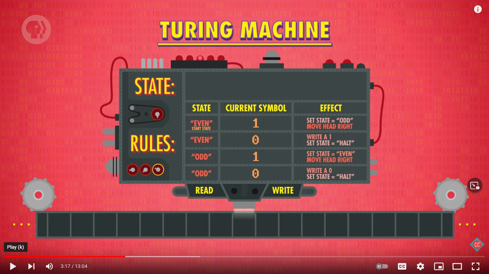

## Some python Scripts for class

## The even odd Turing Machine

This is a model of a simple Turing machine using a list as a tape and a function to hold the state variables and rules.

This machine will count the number of ones on a tape before reaching a zero. 

Then, it will return a zero if the number is odd and and one if the number is even

