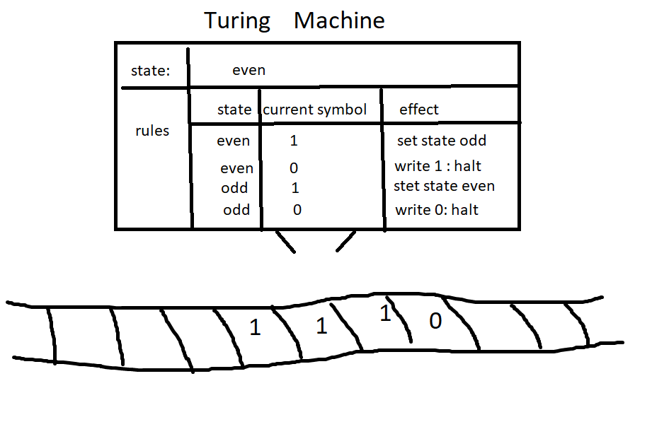

## Some python Scripts for class

## The even odd Turing Machine

This is a model of a simple Turing machine using a list as a tape and a function to hold the state variables and rules.

This machine will count the number of ones on a tape before reaching a zero. 

Then, it will return a zero if the number is odd and and one if the number is even

The concept and image are from: Alan Turing: Crash Course Computer Science #15

https://youtu.be/7TycxwFmdB0

I have written a function in python to model this even odd touring machine

see the code above 

or run it live at

https://replit.com/@greggelong/turingMachineEvenOdd?v=1

-------

## [Infinite monkey theorem](https://en.wikipedia.org/wiki/Infinite_monkey_theorem)

from wikipedea

>The infinite monkey theorem states that a monkey hitting keys at random on a typewriter keyboard for an infinite amount of time will almost surely type any given text, such as the complete works of William Shakespeare. In fact, the monkey would almost surely type every possible finite text an infinite number of times. 
>

